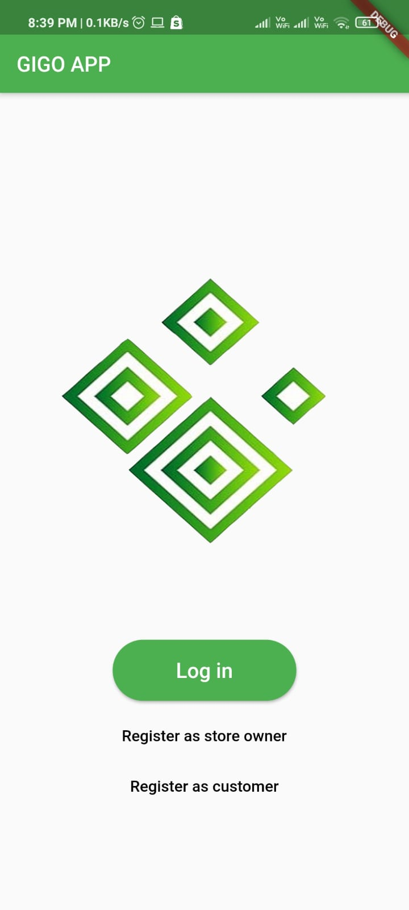
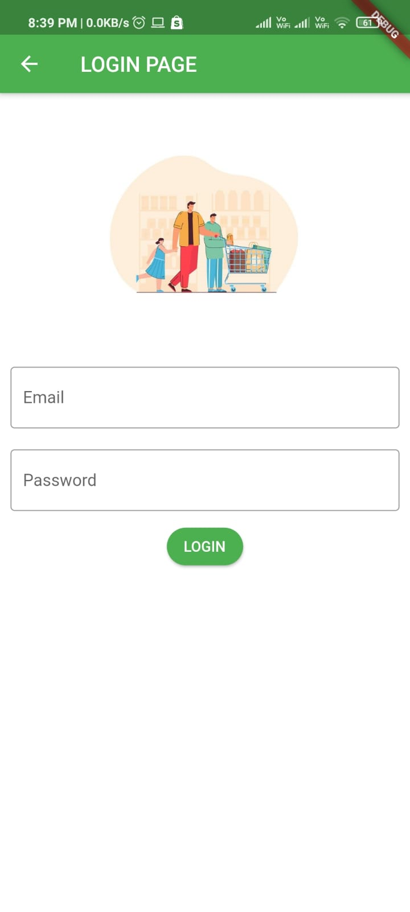
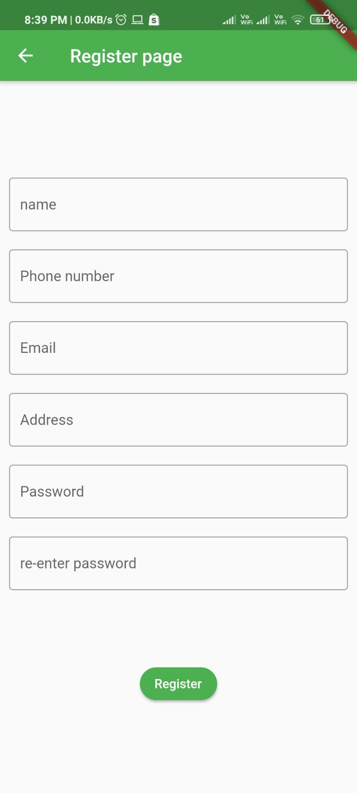
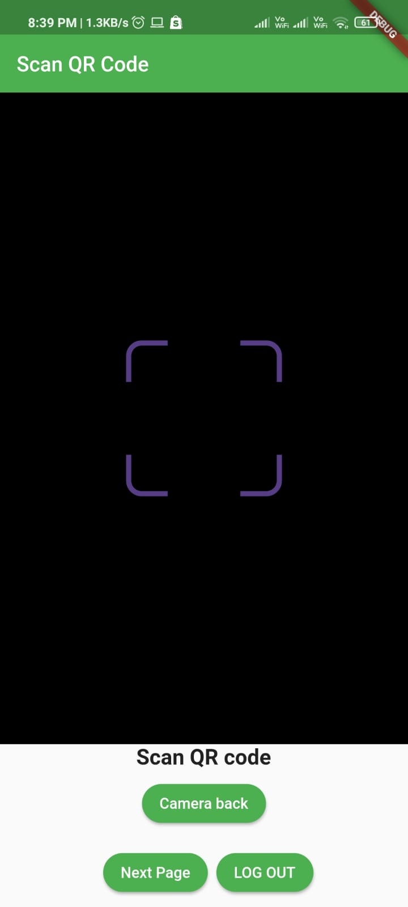
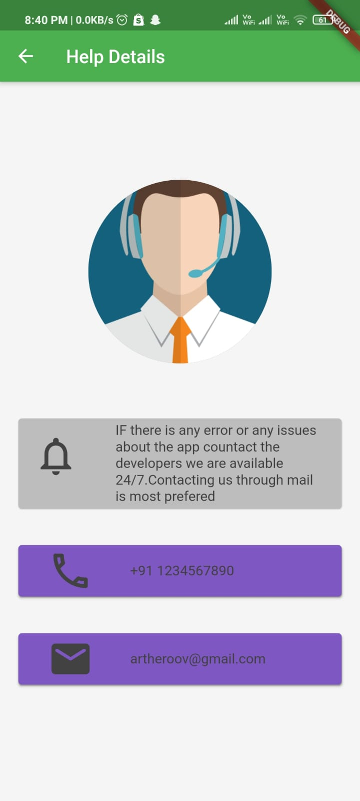

# GIGO APP

Gigo app is a mobile application where shopkeepers have an app that shows QR code and users can scan this QR code which will automatically add that user to the visitor list. This should replace manual entry of contact details in the shop and make the process contactless.

</t>

## Team members : 
1.JASIRA T P  -  GitHub Id:  JASIRAJASI         
2.SHRAVAN SREEDEEP -  GitHub Id:  ShravanSreedeep

## How it works :
Please refer the video : https://drive.google.com/file/d/1tmORObpP9kYn-jJMCAiyb03Z8uSy0dAn/view?usp=drivesdk
 
 ## Libraries used :
 package:flutter/material.dart,
 package:cloud_firestore/cloud_firestore.dart,
 package:firebase_auth/firebase_auth.dart,
 package:rflutter_alert/rflutter_alert.dart,
 package:flutter_spinkit/flutter_spinkit.dart,
 package:url_launcher/url_launcher.dart,
 package:rflutter_alert/rflutter_alert.dart,
 package:firebase_core/firebase_core.dart,
 package:qr_flutter/qr_flutter.dart,
 package:flutter/rendering.dart,
 package:flutter/foundation.dart,
 package:qr_code_scanner/qr_code_scanner.dart,
 package:flutter/widgets.dart
 
 ## How to configure :
 First of all we need to install flutter in our PC. Refer the link for more information regarding the installation of flutter:
 https://flutter.dev/docs/get-started/install/windows .
 
 Set up a Google Firebase account and download the .json file from the new project and set it up in the given folder as shown in the google firebase website. Configure the 
 build.gradle as given in the google firebase website. 
 
 ## How to run :
 In order to run the program an android emulator or USB debugging enabled device should be connected to the computer. Then by giving the command "flutter run" in command prompt and the app will be installed in the connected device/emulator. The apk of the flutter app can be generated using "flutter build apk" command in command prompt. 
      

-----------------------------------------------------------------------------------------------------------------------------------------------------------
- [Lab: Write your first Flutter app](https://flutter.dev/docs/get-started/codelab)
- [Cookbook: Useful Flutter samples](https://flutter.dev/docs/cookbook)

For help getting started with Flutter, view our
[online documentation](https://flutter.dev/docs), which offers tutorials,
samples, guidance on mobile development, and a full API reference.
